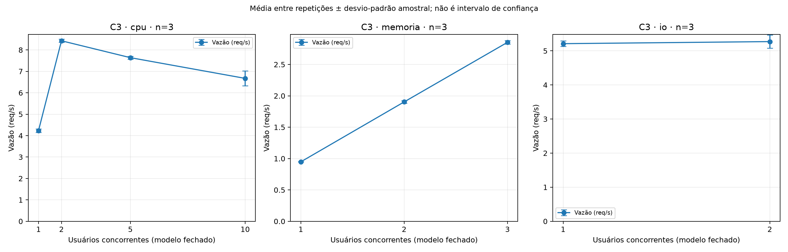
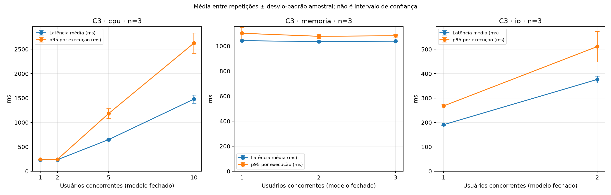
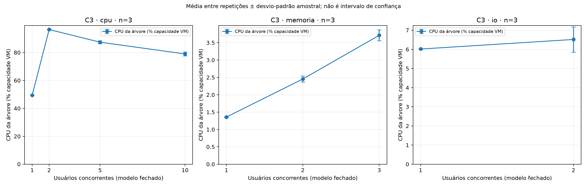
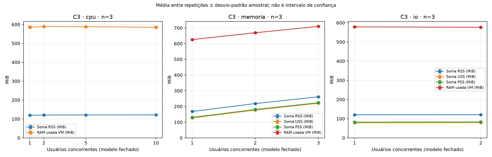
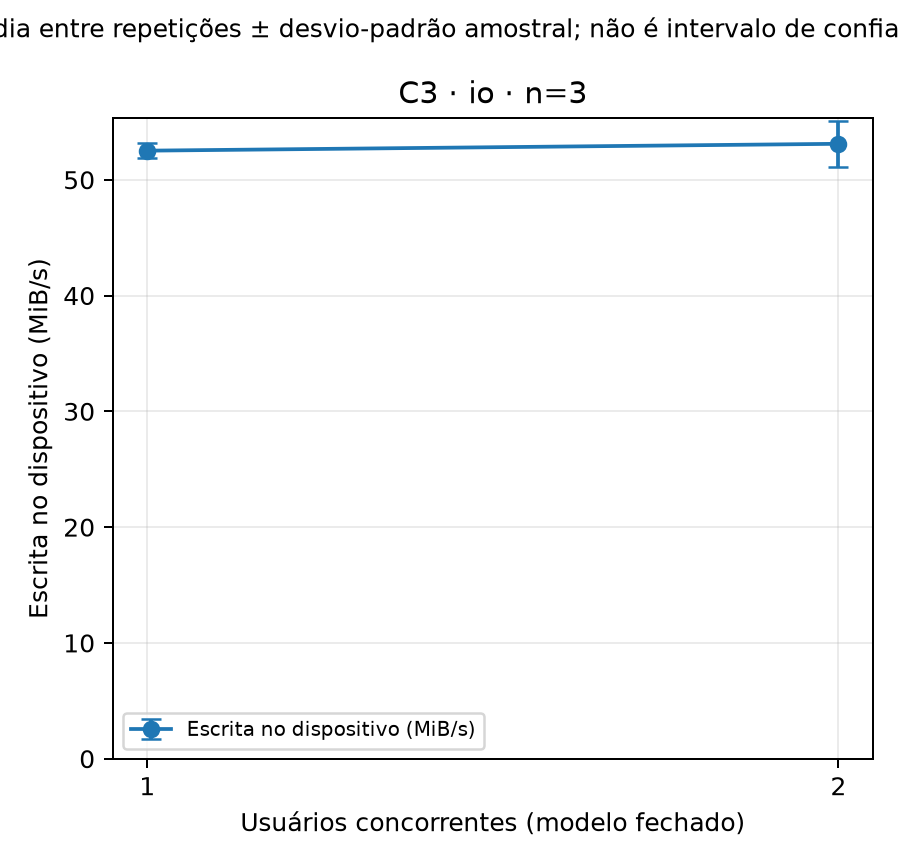

# Análise definitiva — C3

## Seleção e método

27 execuções concluídas; nove combinações; três repetições lógicas (1, 2, 3) por combinação. Seleção restrita ao índice da campanha; base identificada nos registros: 3000. Numeração segue base + 10 × (tentativa − 1) + repetição lógica. Estados não concluídos e registros fora da base são excluídos.

As unidades independentes são as repetições, com peso igual. Média = soma dos três valores / 3; desvio-padrão amostral usa divisor n−1. Mínimo/máximo são entre repetições, não entre requisições. O p95 agregado é a média dos p95 de cada execução, não o p95 de requisições reunidas. Falhas são contagens na janela útil; vazão = respostas concluídas / duração útil. Snapshots acumulados são preservados no CSV individual, mas não usados nessas estatísticas.

Ausentes não são imputados; cada estatística informa n válido. Campos essenciais ausentes, repetições incompletas e tentativas concluídas ambíguas impedem a análise. USS/PSS/disco ausentes são explicitados; DP com menos de duas observações permanece ausente.

## Resultados observados

| Aplicação | Usuários | Vazão média (req/s) | Latência média (ms) | Média dos p95 (ms) | CPU árvore (%) | RSS (MiB) | Falhas médias |
|---|---:|---:|---:|---:|---:|---:|---:|
| cpu | 1 | 4.231 | 235.036 | 246.032 | 49.393 | 119.792 | 0.000 |
| cpu | 2 | 8.428 | 235.890 | 242.429 | 96.466 | 120.621 | 0.000 |
| cpu | 5 | 7.640 | 648.312 | 1182.615 | 87.392 | 121.311 | 0.000 |
| cpu | 10 | 6.672 | 1478.468 | 2626.153 | 78.994 | 121.684 | 0.000 |
| memoria | 1 | 0.948 | 1042.763 | 1102.014 | 1.357 | 168.056 | 0.000 |
| memoria | 2 | 1.903 | 1035.834 | 1077.871 | 2.454 | 218.446 | 0.000 |
| memoria | 3 | 2.853 | 1038.760 | 1082.338 | 3.712 | 261.262 | 0.000 |
| io | 1 | 5.210 | 190.856 | 267.716 | 6.018 | 120.238 | 0.000 |
| io | 2 | 5.271 | 376.365 | 511.206 | 6.516 | 120.796 | 0.000 |

Escrita no dispositivo explicitamente selecionado (não somada às partições):

| Usuários I/O | Dispositivo | Escrita média (MiB/s) | Total médio nos intervalos (MiB) |
|---:|---|---:|---:|
| 1 | sda | 52.511 | 3045.180 |
| 2 | sda | 53.104 | 3080.154 |

## Análise interpretativa

CPU: a vazão passa de 4.231 para 8.428 req/s entre um e dois usuários. Com cinco e dez, registra 7.640 e 6.672 req/s. As latências médias correspondentes são 648.312 e 1478.468 ms. A CPU da árvore com dois usuários é 96.466% da capacidade VM. Esses valores são observados; limitação por CPU e fila são hipóteses compatíveis quando alta utilização acompanha aumento de latência. Variações de CPU/vazão também podem envolver agendamento e sobrecarga; estes dados não isolam a causa nem demonstram saturação monotônica.

Memória: RSS médio passa de 168.056 a 261.262 MiB entre um e três usuários. A vazão correspondente passa de 0.948 para 2.853 req/s; CPU da árvore de 1.357% para 3.712%. Retenção declarada nos consolidados (segundos): 1.0. Quando habilitada, participa do tempo de resposta: serve à observação das alocações e não representa custo de acesso à RAM. Não há demonstração de esgotamento de RAM ou saturação de largura de banda da memória; o nome Memory-bound identifica o perfil implementado.

I/O: a vazão passa de 5.210 para 5.271 req/s; latência média de 190.856 para 376.365 ms. CPU da árvore passa de 6.018% para 6.516%. Se o ganho de vazão for limitado com baixa CPU, espera por I/O/sincronização é uma hipótese, mas esses valores não comprovam saturação do disco físico do Windows. Cache, fsync, disco virtual e outras atividades podem influenciar. Os contadores são do dispositivo da VM inteira; escrita lógica de arquivos não equivale a escrita física no host.

## Limitações e avisos metodológicos

CPU da árvore é soma dos percentuais dos processos dividida pelas CPUs lógicas; 100% representa a capacidade total da VM; CPUs lógicas observadas/declaradas: 2. CPU global permanece separada, sem reconciliar contadores inconsistentes. Médias de recursos são as médias amostradas que o consolidado fornece na janela útil.

Soma RSS pode contar páginas compartilhadas mais de uma vez; não é memória privada. USS mede páginas privadas e PSS rateia páginas compartilhadas. RAM usada é do sistema inteiro. Picos são amostrados e podem perder eventos entre coletas. USS/PSS ausentes são explicitados por métrica e execução, não são zero.

Correção de relógios já aplicada pelo consolidador: UTC Windows = UTC Linux − offset (Linux menos Windows). Não se aplica correção novamente. Sondagens não comprovam sincronização perfeita nem eliminam deriva. Avisos originais são preservados por execução em avisos.csv e nos dados individuais.

Disco: um único dispositivo explicitamente selecionado, sem somar sda e sda5. A média de escrita é a média das taxas das amostras já consolidadas; total de bytes e operações cobre os intervalos selecionados, não necessariamente todos os limites UTC da carga. Não se atribui toda atividade à API.

Três repetições permitem descrição da variabilidade, não conclusões causais ou testes de significância. C3 sozinho não demonstra efeito do provisionamento comparado a outros cenários. Tentativas de recuperação podem envolver instrumentação revisada; confira os metadados antes de comparar execuções.

## Auditoria de seleção

- cpu/1: lógica 1, física R3001, tentativa 1.
- cpu/1: lógica 2, física R3002, tentativa 1.
- cpu/1: lógica 3, física R3003, tentativa 1.
- cpu/2: lógica 1, física R3001, tentativa 1.
- cpu/2: lógica 2, física R3002, tentativa 1.
- cpu/2: lógica 3, física R3003, tentativa 1.
- cpu/5: lógica 1, física R3001, tentativa 1.
- cpu/5: lógica 2, física R3002, tentativa 1.
- cpu/5: lógica 3, física R3003, tentativa 1.
- cpu/10: lógica 1, física R3001, tentativa 1.
- cpu/10: lógica 2, física R3012, tentativa 2.
- cpu/10: lógica 3, física R3003, tentativa 1.
- io/1: lógica 1, física R3001, tentativa 1.
- io/1: lógica 2, física R3002, tentativa 1.
- io/1: lógica 3, física R3003, tentativa 1.
- io/2: lógica 1, física R3001, tentativa 1.
- io/2: lógica 2, física R3002, tentativa 1.
- io/2: lógica 3, física R3003, tentativa 1.
- memoria/1: lógica 1, física R3001, tentativa 1.
- memoria/1: lógica 2, física R3002, tentativa 1.
- memoria/1: lógica 3, física R3003, tentativa 1.
- memoria/2: lógica 1, física R3001, tentativa 1.
- memoria/2: lógica 2, física R3002, tentativa 1.
- memoria/2: lógica 3, física R3003, tentativa 1.
- memoria/3: lógica 1, física R3001, tentativa 1.
- memoria/3: lógica 2, física R3002, tentativa 1.
- memoria/3: lógica 3, física R3003, tentativa 1.
- Excluída cpu/10/R3002: estado não concluída.

## Gráficos

