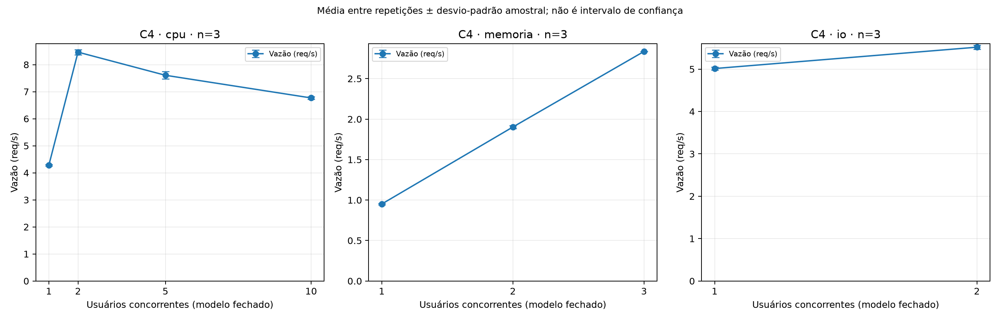
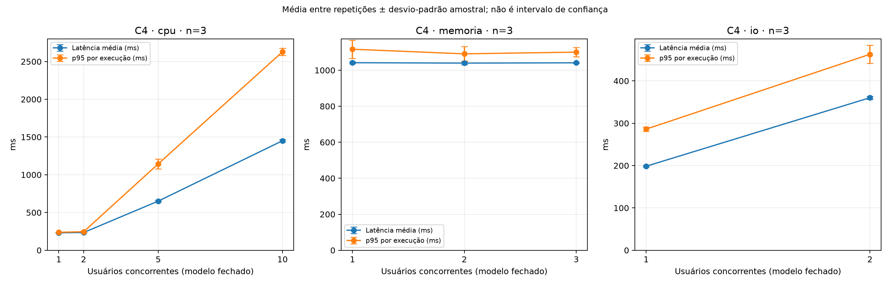
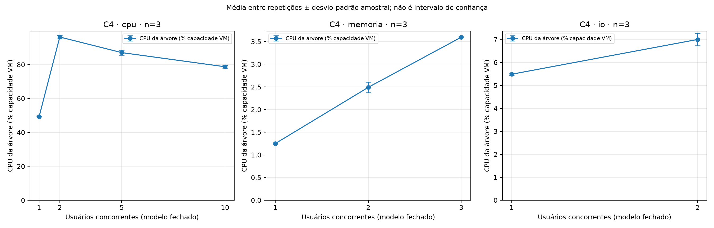
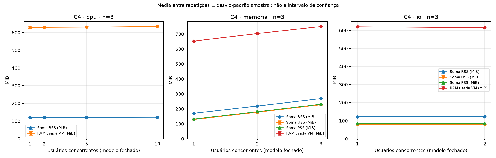
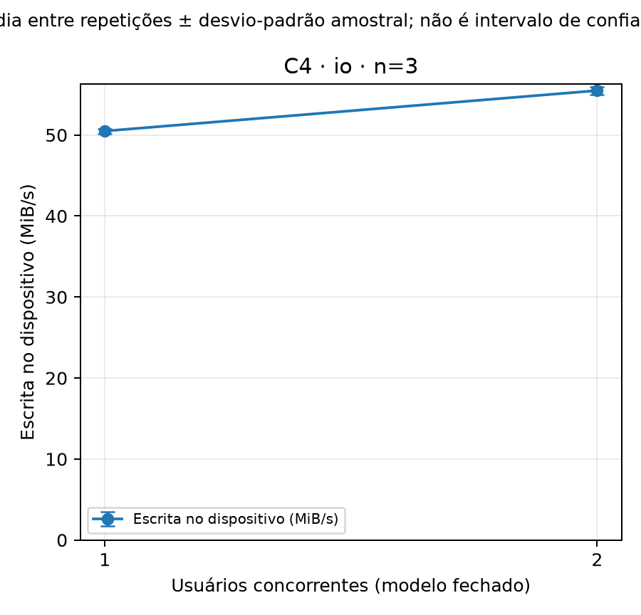

# Análise definitiva — C4

## Seleção e método

27 execuções concluídas; nove combinações; três repetições lógicas (1, 2, 3) por combinação. Seleção restrita ao índice da campanha definitiva; execuções fora da base 2000 e estados não concluídos são excluídos.

As unidades independentes são as repetições, com peso igual. Média = soma dos três valores / 3; desvio-padrão amostral usa divisor n−1. Mínimo/máximo são entre repetições, não entre requisições. O p95 agregado é a média dos p95 de cada execução, não o p95 de requisições reunidas. Falhas são contagens na janela útil; vazão = respostas concluídas / duração útil. Snapshots acumulados são preservados no CSV individual, mas não usados nessas estatísticas.

Ausentes não são imputados; cada estatística informa n válido. Campos essenciais ausentes, repetições incompletas e tentativas concluídas ambíguas impedem a análise. USS/PSS/disco ausentes são explicitados; DP com menos de duas observações permanece ausente.

## Resultados observados

| Aplicação | Usuários | Vazão média (req/s) | Latência média (ms) | Média dos p95 (ms) | CPU árvore (%) | RSS (MiB) | Falhas médias |
|---|---:|---:|---:|---:|---:|---:|---:|
| cpu | 1 | 4.282 | 232.075 | 238.276 | 49.298 | 119.473 | 0.000 |
| cpu | 2 | 8.462 | 235.000 | 244.967 | 96.287 | 120.484 | 0.000 |
| cpu | 5 | 7.607 | 651.042 | 1144.029 | 87.085 | 121.120 | 0.000 |
| cpu | 10 | 6.769 | 1450.999 | 2629.291 | 78.746 | 121.748 | 0.000 |
| memoria | 1 | 0.951 | 1041.748 | 1116.630 | 1.251 | 169.983 | 0.000 |
| memoria | 2 | 1.902 | 1039.699 | 1091.065 | 2.491 | 218.643 | 0.000 |
| memoria | 3 | 2.836 | 1041.266 | 1100.560 | 3.597 | 268.447 | 0.000 |
| io | 1 | 5.014 | 198.479 | 286.137 | 5.485 | 121.645 | 0.000 |
| io | 2 | 5.517 | 360.303 | 462.960 | 6.999 | 121.956 | 0.000 |

Escrita no dispositivo explicitamente selecionado (não somada às partições):

| Usuários I/O | Dispositivo | Escrita média (MiB/s) | Total médio nos intervalos (MiB) |
|---:|---|---:|---:|
| 1 | sda | 50.488 | 2928.380 |
| 2 | sda | 55.484 | 3217.283 |

## Análise interpretativa

CPU: a vazão passa de 4.282 para 8.462 req/s entre um e dois usuários. Com cinco e dez, registra 7.607 e 6.769 req/s, enquanto a latência cresce. A CPU da árvore com dois usuários é 96.287% da capacidade VM. Esses valores são observados; limitação por CPU e fila são hipóteses compatíveis. A redução posterior da CPU/vazão também pode envolver agendamento e sobrecarga; estes dados não isolam a causa nem demonstram saturação monotônica.

Memória: RSS médio passa de 169.983 a 268.447 MiB entre um e três usuários. A vazão cresce com a concorrência, com baixa CPU. A retenção configurada de um segundo participa do tempo de resposta: serve à observação das alocações e não representa custo de acesso à RAM. Não há demonstração de esgotamento de RAM ou saturação de largura de banda da memória; o nome Memory-bound identifica o perfil implementado.

I/O: a vazão passa de 5.014 para 5.517 req/s; latência média de 198.479 para 360.303 ms. O ganho limitado e a baixa CPU são compatíveis com espera por I/O/sincronização, mas não comprovam saturação do disco físico do Windows. Cache, fsync, disco virtual e outras atividades podem influenciar. Os contadores são do dispositivo da VM inteira; escrita lógica de arquivos não equivale a escrita física no host.

## Limitações e avisos metodológicos

CPU da árvore é soma dos percentuais dos processos dividida pelas CPUs lógicas; 100% representa a capacidade das duas vCPUs. CPU global permanece separada, sem reconciliar contadores inconsistentes. Médias de recursos são as médias amostradas que o consolidado fornece na janela útil.

Soma RSS pode contar páginas compartilhadas mais de uma vez; não é memória privada. USS mede páginas privadas e PSS rateia páginas compartilhadas. RAM usada é do sistema inteiro. Picos são amostrados e podem perder eventos entre coletas. USS/PSS da CPU estão ausentes, não são zero.

Correção de relógios já aplicada pelo consolidador: UTC Windows = UTC Linux − offset (Linux menos Windows). Não se aplica correção novamente. Sondagens não comprovam sincronização perfeita nem eliminam deriva. Avisos originais são preservados por execução em avisos.csv e nos dados individuais.

Disco: um único dispositivo explicitamente selecionado, sem somar sda e sda5. A média de escrita é a média das taxas das amostras já consolidadas; total de bytes e operações cobre os intervalos selecionados, não necessariamente todos os limites UTC da carga. Não se atribui toda atividade à API.

Três repetições permitem descrição da variabilidade, não conclusões causais ou testes de significância. C4 sozinho não demonstra efeito do provisionamento comparado a C1–C3. A segunda tentativa usa instrumentação corrigida; isso deve ser considerado na comparação com execuções anteriores.

## Auditoria de seleção

- cpu/1: lógica 1, física R2001, tentativa 1.
- cpu/1: lógica 2, física R2002, tentativa 1.
- cpu/1: lógica 3, física R2003, tentativa 1.
- cpu/2: lógica 1, física R2001, tentativa 1.
- cpu/2: lógica 2, física R2002, tentativa 1.
- cpu/2: lógica 3, física R2003, tentativa 1.
- cpu/5: lógica 1, física R2001, tentativa 1.
- cpu/5: lógica 2, física R2002, tentativa 1.
- cpu/5: lógica 3, física R2003, tentativa 1.
- cpu/10: lógica 1, física R2001, tentativa 1.
- cpu/10: lógica 2, física R2002, tentativa 1.
- cpu/10: lógica 3, física R2003, tentativa 1.
- io/1: lógica 1, física R2001, tentativa 1.
- io/1: lógica 2, física R2002, tentativa 1.
- io/1: lógica 3, física R2003, tentativa 1.
- io/2: lógica 1, física R2001, tentativa 1.
- io/2: lógica 2, física R2012, tentativa 2.
- io/2: lógica 3, física R2003, tentativa 1.
- memoria/1: lógica 1, física R2001, tentativa 1.
- memoria/1: lógica 2, física R2002, tentativa 1.
- memoria/1: lógica 3, física R2003, tentativa 1.
- memoria/2: lógica 1, física R2001, tentativa 1.
- memoria/2: lógica 2, física R2002, tentativa 1.
- memoria/2: lógica 3, física R2003, tentativa 1.
- memoria/3: lógica 1, física R2001, tentativa 1.
- memoria/3: lógica 2, física R2002, tentativa 1.
- memoria/3: lógica 3, física R2003, tentativa 1.
- Excluída io/2/R2002: estado não concluída.

## Gráficos

